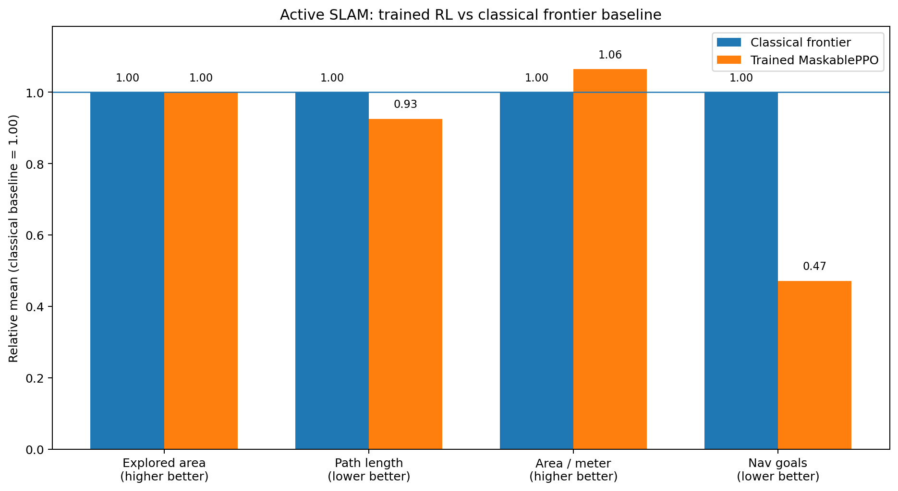
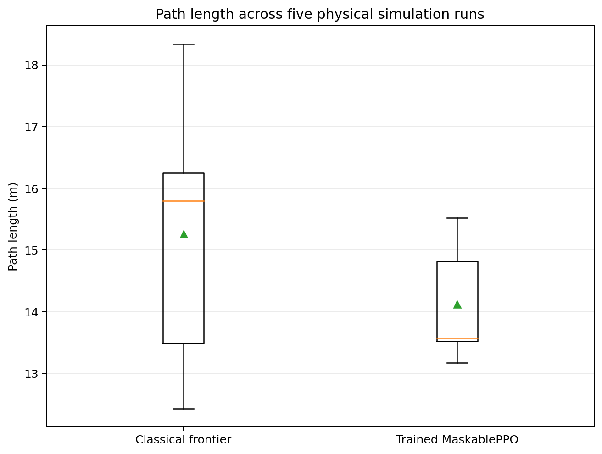
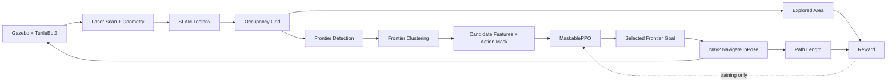

# Active SLAM with Reinforcement Learning

A reproducibility-focused ROS 2 research project that learns **which frontier
to explore next** during autonomous SLAM.

The system combines:

- ROS 2 Jazzy
- Gazebo / TurtleBot3 simulation
- SLAM Toolbox
- Nav2
- frontier-based exploration
- Gymnasium
- MaskablePPO from `sb3-contrib`
- auditable training and frozen-policy evaluation

The learned policy does not replace SLAM or navigation. It replaces the
**frontier-selection decision** while retaining classical frontier detection
and Nav2 execution.

---

## Result

Five physical simulation runs of the frozen trained policy were compared
descriptively with five frozen classical nearest-frontier runs.

| Metric | Classical frontier | Trained RL | Difference |
|---|---:|---:|---:|
| Newly explored area | 18.5165 m² | 18.5140 m² | **-0.014%** |
| Path length | 15.2621 m | 14.1225 m | **-7.47%** |
| Area per meter | 1.2362 m²/m | 1.3159 m²/m | **+6.45%** |
| Navigation goals | 10.60 | 5.00 | **-52.83%** |
| Navigation success | 100% | 100% | maintained |

The trained MaskablePPO frontier selector therefore preserved essentially
the same explored area while using a shorter path and substantially fewer
high-level navigation decisions.



The normalized figure uses the classical frontier mean as `1.00`. Lower is
better for path length and navigation-goal count; higher is better for explored
area and area-per-meter efficiency.



These are **descriptive results across five physical simulation repetitions
per method**, not a statistical-significance claim.

### Varied-start robustness sanity check

The same frozen trained checkpoint was also evaluated from three altered
initial robot poses in the same simulation world. All three episodes completed,
all 21/21 Nav2 goals succeeded, and the policy fingerprint remained unchanged
with zero PPO updates.

This is useful evidence against memorizing one exact start pose or one exact
trajectory, but it is **not** a claim of generalization to unseen worlds.

See [varied-start robustness results](docs/experiments/varied_start_robustness.md).

Full methodology and limitations:

- [RL vs frontier results](docs/experiments/rl_vs_frontier_results.md)
- [Classical frontier results](docs/experiments/frontier_baseline_results.md)
- [Frozen baseline protocol](docs/experiments/baseline_protocol.md)
- [Reproducibility and evidence](docs/reproducibility.md)

---

## System Architecture



During frozen evaluation the policy receives observations and selects
frontiers, but **no PPO optimization occurs**.

---

## RL Formulation

### Observation

The observation is a Gymnasium dictionary containing up to **32 frontier
candidates**.

Each candidate has four features:

1. relative x position
2. relative y position
3. Euclidean distance from the robot
4. frontier-cluster size

The observation also contains a 32-element action mask identifying valid
candidate slots.

### Action

The action space is:

```text
Discrete(32)
```

An action selects one currently valid frontier candidate.

Invalid candidate slots are masked before MaskablePPO chooses an action.

### Reward

The reward favors new map information while penalizing unnecessary travel:

```text
reward = newly_explored_area_m2 - 0.10 * path_delta_m
```

### Episode lifecycle

Every physical episode receives a fresh:

- Gazebo simulation
- Nav2 stack
- SLAM process
- occupancy map

Episodes finish when actionable frontiers are exhausted or the episode time
limit is reached.

---

## Classical Baseline

The reference policy is a frozen nearest-frontier explorer.

It:

1. extracts frontier cells from the occupancy grid,
2. clusters them,
3. rejects undersized or unsuitable clusters,
4. generates reachable frontier goals,
5. selects the nearest remaining candidate,
6. sends the goal through Nav2.

Five formal baseline repetitions are preserved under:

```text
experiments/baseline/
```

The frozen protocol is documented in
[`docs/experiments/baseline_protocol.md`](docs/experiments/baseline_protocol.md).

---

## Learned Policy

The RL policy uses:

- `MaskablePPO`
- `MultiInputPolicy`
- masked discrete frontier selection
- physical Gazebo/Nav2/SLAM transitions
- `n_steps = 16`
- `batch_size = 8`
- `n_epochs = 10`
- CPU training

The reference substantive training run used **64 physical transitions**.

The completed run contained:

- 64 recorded transitions
- 10 physical SLAM episodes
- 4 PPO optimization cycles
- 40 PPO epochs/updates
- 63 successful navigation actions out of 64
- a changed final policy fingerprint

The final checkpoint was then evaluated separately with learning disabled.

---

## Frozen Evaluation

Evaluation loads a checkpoint using:

```bash
python3 -m active_slam_rl.rl_eval
```

The evaluation contract enforces:

- deterministic actions,
- action masking,
- no `learn()` call,
- zero recorded PPO optimization updates,
- policy fingerprint before evaluation,
- policy fingerprint after evaluation,
- failure if policy parameters change.

This prevents an evaluation run from silently continuing training.

---

## Reproducibility

Formal runs record decision-level evidence rather than only terminal output.

Training evidence includes:

```text
metadata.json
config.json
resolved_model.json
steps.csv
episodes.csv
updates.csv
summary.json
initial_model.zip
initial_model.sha256
model.zip
model.sha256
console.log
invocation.txt
evidence_manifest.sha256
```

The experiment recorder captures:

- Git commit
- clean/dirty worktree state
- Python executable and version
- package versions
- exact action masks
- selected actions
- goals
- rewards
- explored area
- path length
- robot pose
- navigation outcomes
- episode outcomes
- PPO optimization telemetry
- policy fingerprints
- checkpoint hashes

See [docs/reproducibility.md](docs/reproducibility.md).

---

## Repository Layout

```text
active-slam-rl/
├── README.md
├── LICENSE
├── CITATION.cff
├── requirements-rl.txt
│
├── ros2_ws/
│   └── src/
│       └── active_slam_rl/
│           ├── active_slam_rl/
│           │   ├── frontier_detector.py
│           │   ├── frontier_explorer.py
│           │   ├── rl_env.py
│           │   ├── rl_observation_node.py
│           │   ├── rl_training_env.py
│           │   ├── rl_train.py
│           │   ├── rl_eval.py
│           │   ├── rl_recording_env.py
│           │   ├── rl_experiment.py
│           │   └── rl_model_evidence.py
│           └── test/
│
├── experiments/
│   ├── baseline/
│   ├── rl/
│   └── comparison/
│
└── docs/
    ├── reproducibility.md
    └── experiments/
```

---

## Key Implementation Files

| Component | Implementation |
|---|---|
| Classical frontier explorer | [`frontier_explorer.py`](ros2_ws/src/active_slam_rl/active_slam_rl/frontier_explorer.py) |
| Gymnasium environment | [`rl_env.py`](ros2_ws/src/active_slam_rl/active_slam_rl/rl_env.py) |
| Physical observation bridge | [`rl_observation_node.py`](ros2_ws/src/active_slam_rl/active_slam_rl/rl_observation_node.py) |
| Fresh physical sessions | [`rl_training_env.py`](ros2_ws/src/active_slam_rl/active_slam_rl/rl_training_env.py) |
| PPO training entrypoint | [`rl_train.py`](ros2_ws/src/active_slam_rl/active_slam_rl/rl_train.py) |
| Frozen checkpoint evaluation | [`rl_eval.py`](ros2_ws/src/active_slam_rl/active_slam_rl/rl_eval.py) |
| Decision-level evidence | [`rl_recording_env.py`](ros2_ws/src/active_slam_rl/active_slam_rl/rl_recording_env.py) |
| Experiment provenance | [`rl_experiment.py`](ros2_ws/src/active_slam_rl/active_slam_rl/rl_experiment.py) |
| PPO fingerprints/telemetry | [`rl_model_evidence.py`](ros2_ws/src/active_slam_rl/active_slam_rl/rl_model_evidence.py) |

---

## Prerequisites

The audited environment used:

```text
Ubuntu 24.04
ROS 2 Jazzy
Nav2
SLAM Toolbox
TurtleBot3 simulation
Python 3.12
Gymnasium 1.3.0
Stable-Baselines3 2.9.0
sb3-contrib 2.9.0
PyTorch 2.9.1+cpu
```

A CPU is sufficient for the current policy architecture.

---

## Build

Clone the repository:

```bash
git clone https://github.com/owais03321-glitch/active-slam-rl.git
cd active-slam-rl
```

Create a Python environment that can still access ROS Python packages:

```bash
python3 -m venv --system-site-packages .venv
source .venv/bin/activate

python3 -m pip install --upgrade pip
python3 -m pip install -r requirements-rl.txt
```

Source ROS and build the package:

```bash
source /opt/ros/jazzy/setup.bash

cd ros2_ws
colcon build --symlink-install
cd ..

source ros2_ws/install/setup.bash

export PYTHONPATH="$PWD/ros2_ws/src/active_slam_rl${PYTHONPATH:+:$PYTHONPATH}"
```

---

## Validate the RL Stack Without Starting Gazebo

```bash
python3 -m active_slam_rl.rl_train --validate-only
```

The validation checks the policy type, vectorized environment, action-masking
support, rollout size, and verifies that model construction does not launch a
physical simulation.

---

## Run Functional and Contract Tests

```bash
python3 -m pytest -q \
  ros2_ws/src/active_slam_rl/test \
  --ignore=ros2_ws/src/active_slam_rl/test/test_flake8.py \
  --ignore=ros2_ws/src/active_slam_rl/test/test_pep257.py
```

The two ROS template lint modules are intentionally separate from the
functional contract suite. The project build, RL validation, and behavioral
tests are gated independently.

---

## Train

A physical training run can be started with:

```bash
python3 -m active_slam_rl.rl_train \
  --train 64 \
  --run-id my_train_run \
  --run-kind diagnostic \
  --seed 0 \
  --device cpu \
  --n-steps 16 \
  --batch-size 8 \
  --evidence-root "$HOME/active-slam-rl-evidence"
```

Formal runs additionally require a clean Git worktree.

---

## Evaluate a Frozen Checkpoint

```bash
python3 -m active_slam_rl.rl_eval \
  --checkpoint /path/to/model.zip \
  --episodes 5 \
  --run-id my_frozen_eval \
  --run-kind diagnostic \
  --seed 0 \
  --device cpu \
  --evidence-root "$HOME/active-slam-rl-evidence"
```

No policy optimization occurs during this command.

---

## Visual Frozen-Policy Demo

For a presentation or portfolio recording, run the trained checkpoint with
Gazebo and RViz visible while printing each policy decision and physical
transition:

```bash
python3 -m active_slam_rl.rl_eval \
  --checkpoint /path/to/model.zip \
  --episodes 1 \
  --run-id visual_demo \
  --run-kind diagnostic \
  --seed 0 \
  --device cpu \
  --visual \
  --verbose-steps \
  --evidence-root "$HOME/active-slam-rl-evidence"
```

The visual mode still uses the frozen evaluation contract: deterministic
masked actions, zero PPO optimization updates, and unchanged policy
fingerprints before and after the episode.

---

## Research Limitations

This repository intentionally documents limitations rather than hiding them.

1. The reported RL-versus-frontier comparison contains five physical
   repetitions per method and is descriptive rather than a strong
   significance claim.

2. The Gym reset seed is recorded, but the current Gazebo launch does not
   explicitly control the simulator random seed.

3. The classical baseline uses a fixed approximately 300-second evaluation
   horizon, while the current RL evaluator may terminate earlier when
   actionable frontiers are exhausted. Cross-method completion times are
   therefore not presented as directly comparable.

4. The current results are from simulation, not a physical robot.

5. The reference learned checkpoint was trained from a deliberately small
   64-transition physical dataset. Longer-training studies remain possible,
   but were not required to obtain the reported efficiency improvement.

---

## Research Direction

Possible extensions include:

- explicit Gazebo simulator seeding,
- additional worlds and initial poses,
- longer PPO training studies,
- statistical evaluation over larger trial counts,
- real TurtleBot deployment,
- richer frontier descriptors,
- recurrent or graph-based policies,
- multi-objective reward design.

---

## License

Licensed under the Apache License 2.0. See [LICENSE](LICENSE).

---

## Citation

Citation metadata is provided in [`CITATION.cff`](CITATION.cff).

---

## Status

**Research prototype with complete physical-simulation training, frozen
evaluation, classical-baseline comparison, reproducibility evidence, and
quantitative results.**
